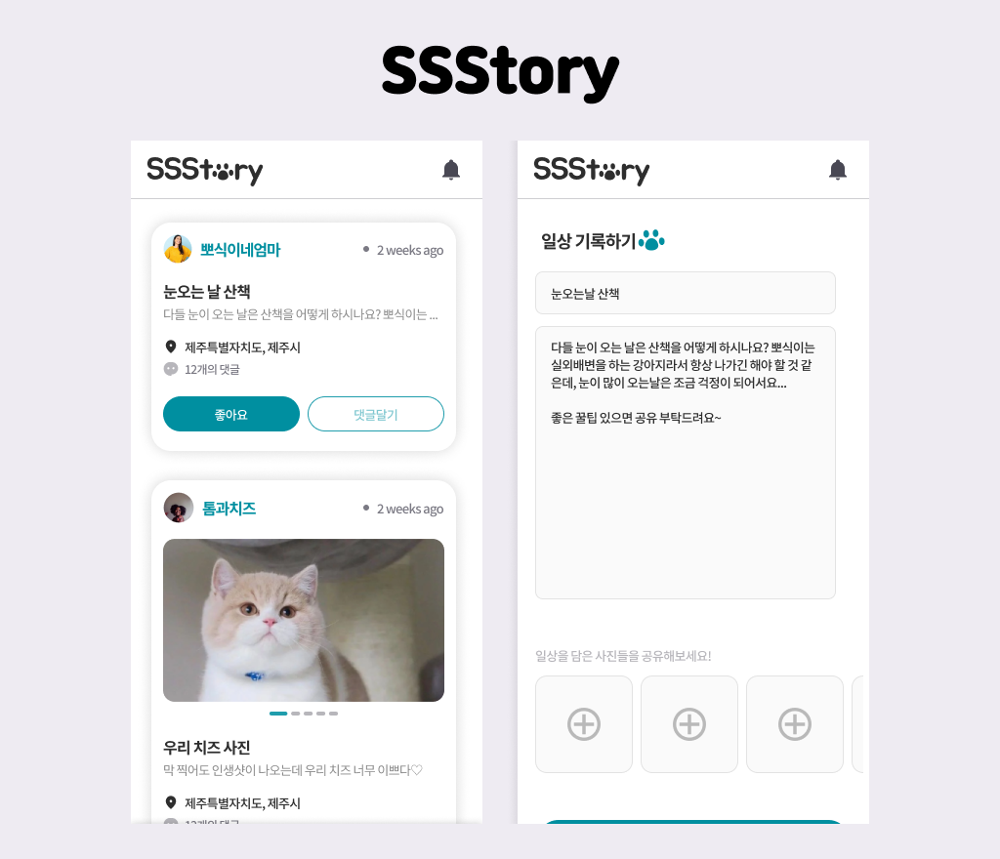

## MySSStory
- 애완동물과 관련된 글을 올리는 커뮤니티 페이지를 만들고자 하였습니다. 
- 로그인, 회원가입기능, 게시글 작성하기, 미니게임, 마이페이지로 구성되었습니다.

### 프로젝트 소개
- nuxt2, scss 로 작업
- 회원가입 정보는 로컬스토리지에 저장될 수 있게 구성하였습니다.
- 게시글 정보는 스토어데이터로 저장할 수 있게 하였습니다.
- Lodash 라이브러리를 사용하여 게시글 데이터의 조회, 저장, 삭제 등을 구현하였습니다.
- 미들웨어에서 로그인 정보를 체크하여 로그인 정보가 없을 경우 redirect할 수 있게 하였습니다.
- nuxt의 layouts기능을 이용하여 페이지 이동에 인터랙션을 추가하였습니다.
- dayjs를 이용해 게시글 작성일자 표시를 할 수 있게 하였습니다.
- mixin을 사용하여 자주 사용하는 methods를 호출할 수 있도록 하였습니다.

### 프로젝트 설명
- 작업기간 : 2024.05.27 - 2024.07.12
- 사용 언어: Nuxt2, scss 사용

